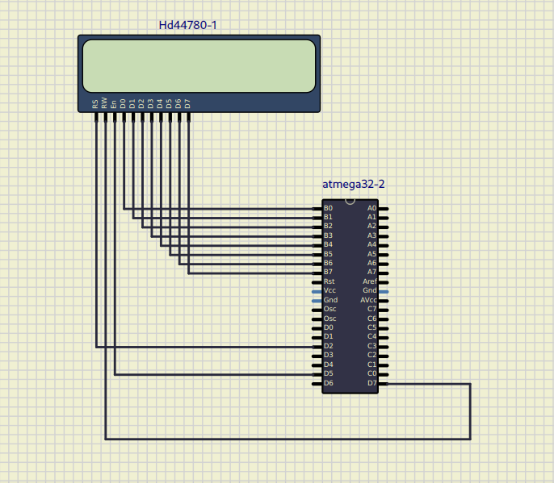

# LCD driver for C avr

_B0 pin wires to D0 (LCD) .. and so on_<br>
*Reset pin wires to D2*<br>
*Read/Write pin wires to D7*<br>
*Enable pin wires to D5*<br>
<br>
<br>
<br>
Schema will be like this<br>

<br>
<br>
To compile
<br>
```avr-gcc -mmcu=atmega32 -Os main.c -o main.bin```<br>
```avr-objcopy -j .text -j .data -O ihex main.bin main.hex```
<br>Or use make file
